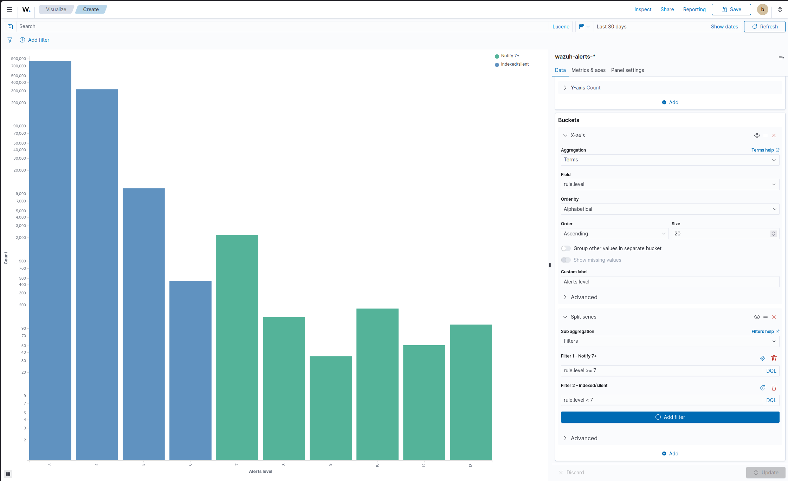
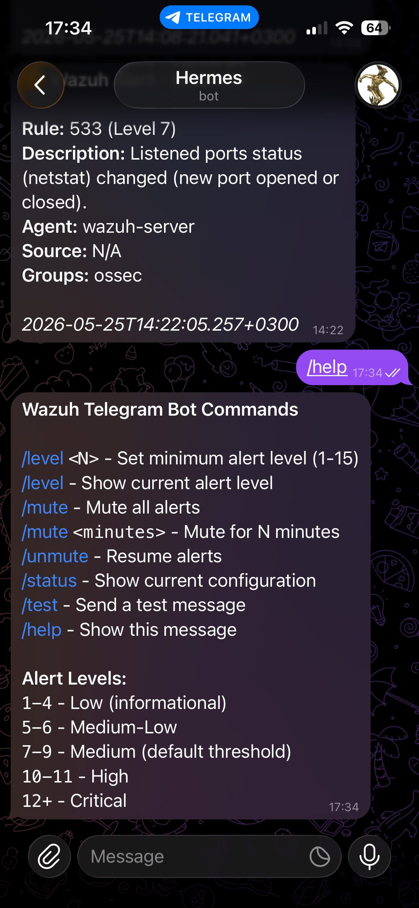

<div align="center">

# SOC driven by Wazuh and Suricata

**A homelab detection stack built for signal, not noise - Wazuh + Suricata, custom MITRE-aligned rules, and level-tiered alerting.**

[Architecture](#architecture) · [Rule model](#the-rule-model-three-tiers) · [Set up](#set-up) · [Part of NoxLab ↗](https://github.com/FabulaNox/NoxLab)

[](LICENSE)

</div>

---

A homelab **detection stack** built for signal, not noise: **Wazuh** (SIEM) +
**Suricata** (network IDS), with custom MITRE-aligned rules, vulnerability-feed
tuning, threat-intel enrichment, and a **level-tiered alerting** model that keeps
a real-time channel trustworthy. It feeds the overnight
[agentic-soc-triage](https://github.com/FabulaNox/agentic-soc-triage) digest.

The whole design bends to one fact: a homelab SIEM out of the box is a *wall of
false positives*. A channel that cries wolf is one you stop reading - so the
work here is the rule engineering that decides what is actually worth a human's
attention.

## Contents

- [Architecture](#architecture)
- [The rule model (three tiers)](#the-rule-model-three-tiers)
  - [Cutting CVE noise without going blind](#cutting-cve-noise-without-going-blind)
- [Alerting tiers](#alerting-tiers)
- [Set up](#set-up)
- [Maintain](#maintain)
- [Gotchas](#gotchas)
- [Screenshots](#screenshots)

---

## Architecture

```
endpoint agents (Sysmon + Wazuh)  ┐
edge-router syslog                 ├─►  Wazuh SIEM  ──►  ranked alerts (level)
Suricata IDS (eve.json)            ┘        ▲                 │
abuse.ch threat-intel ──(CDB lists)─────────┘                 ├─ level 7+ ─► Telegram (real time)
                                                              └─ overnight ─► daily report ─► L1 agent
```

- **Sources:** endpoint agents (auth, process, file-integrity, Sysmon), the edge
  router's syslog (custom decoders), and Suricata network alerts - host, network,
  and perimeter detections on one timeline.
- **Enrichment:** public IOC feeds (abuse.ch) pulled into Wazuh CDB lists on a
  timer, so an alert touching a known-bad IP/domain/hash is tagged.
- **What rises:** alert **level** is the filter; custom rules demote known-benign
  noise *below* the notification threshold and promote what matters *above* it.


*Live SOC overview, built from aggregate counts only (no agent / host / IP fields). The notify band is a thin sliver above a much larger indexed-but-silent baseline - the tuning at work.*

## The rule model (three tiers)

See [`rules/local_rules.xml`](rules/local_rules.xml) for the anonymised set.

| Tier | Level | Purpose |
|---|---|---|
| **Baseline visibility** | 3 | Capture process/network/DNS/driver events as searchable data - no notification |
| **Suppressions** | 0 | Silence known-good, per-host noise (scoped to the exact machine) |
| **Detections** | 7-12 | The alerts that matter - fire the real-time channel at level 7+ |

Detections include CreateRemoteThread (process injection), unsigned driver loads,
registry persistence (`Run`/`RunOnce`/`Services`), alternate-data-stream writes,
and execution from suspicious paths (`Temp`, `Public`). They are mapped to
MITRE ATT&CK techniques.


*The three tiers in `local_rules.xml`: baseline visibility (3), path-anchored suppressions (0), and MITRE-mapped detections (7-12).*

### Cutting CVE noise without going blind

The single biggest win. The box runs a bleeding-edge kernel, which generated
**~1,815 vulnerability alerts a day** - almost all `Package default status` (no
upstream fix available yet, so not actionable). Blanket-suppressing them would
hide *real* fixable vulns. The fix is surgical:

| Custom rule | Effect |
|---|---|
| Suppress unscored CVEs (no CVSS yet) | ~637/day eliminated |
| Medium severity -> level 3 | indexed, silent |
| High / Critical **with** `Package default status` -> level 4 (sub-notification) | quiet: nothing to do yet |
| High / Critical **without** that condition -> left at raw level 9 / 13 | **fires** - a real fix exists |

The discriminator is the field `vulnerability.package.condition`: a fixable vuln
still pages me; an unfixable one is indexed and quiet. Noise down ~95%, coverage
of *actionable* vulns intact.

## Alerting tiers

| Level | Treatment |
|---|---|
| 0-5 | Indexed and searchable, but silent |
| 7+ | Real-time push (Telegram) - scan, brute-force, threat-intel hit |
| 12+ | Emergency - always pushed |

Keeping the bar at 7 is what makes the channel worth reading: custom rules push
known-benign *below* it and promote what matters *to* it.



*Alert volume by level (log scale, 30 days). The sub-7 bands dwarf the notify band by orders of magnitude - most of what the SIEM sees is intentionally kept below the pager threshold.*



*What clearing the bar looks like: a level-7 alert pushed to Telegram in real time. Only level 7+ reaches this channel - everything below is indexed and silent.*

## Set up

A condensed deploy of the stack (abstracted - fill in your own hosts/addresses):

**1. Manager stack (a dedicated VM).** Install `wazuh-manager`, `wazuh-indexer`,
`wazuh-dashboard`. Start them **in order** - indexer, then manager, then
dashboard:

```bash
sudo systemctl restart wazuh-indexer
sudo systemctl restart wazuh-manager
sudo systemctl restart wazuh-dashboard
sudo systemctl is-active wazuh-indexer wazuh-manager wazuh-dashboard
```

**2. Network IDS.** Run Suricata on the core host, sniff the LAN interface,
write `eve.json`, and have the Wazuh agent ingest it so network detections land
next to host detections. Raise the AF-PACKET `ring-size` past the default if you
see kernel drops under load.

**3. Endpoint agents.** Install the Wazuh agent on each endpoint; on Windows, add
Sysmon and forward its EventChannel. Register agents to the manager.

**4. Custom rules.** Drop [`rules/local_rules.xml`](rules/local_rules.xml) into
`/var/ossec/etc/rules/local_rules.xml` on the manager and restart it. Scope
per-host suppressions with `win.system.computer` (see Gotchas).

**5. Threat-intel.** Pull public IOC feeds into Wazuh CDB lists on a timer; add
a rule that tags any alert touching a listed indicator.

**6. Real-time alerting.** Wire a custom integration (`ossec.conf` integration
block) that pushes level-N+ alerts to a chat bot, with the threshold set so only
tier-3 detections notify.

## Maintain

- **Updates, in order:** manager stack first (indexer -> manager -> dashboard),
  then agents. Agents do **not** auto-update; Wazuh supports N-1 compatibility,
  so a brief manager/agent version gap is safe, but bring agents up promptly.
- **Tune from the patterns catalog:** every recurring false positive gets a
  documented decision before a suppression is written (see Gotchas - a
  suppression is a hole in your own detection).

## Gotchas

Real detection-engineering traps from building this:

- **`agent.name` does not work in rule evaluation.** Agent metadata is not a
  decoded field at rule-eval time. Scope rules by `win.system.computer` instead,
  and confirm the value against a live alert (it's the OS hostname, not the
  Wazuh agent name).
- **The field name that silently failed for months.** A rule matched on
  `vulnerability.condition` and simply never fired - the decoded path is
  `vulnerability.package.condition` (Wazuh strips the `data.` prefix, so
  `<field name="X.Y.Z">` matches `data.X.Y.Z`). A rule that never matches is
  invisible: always cross-check the real JSON path in `alerts.json`.
- **PCRE2 over-escaping on Windows process names.** Wazuh double-decodes Windows
  paths, so a leading `\\` before a process name breaks the match. Use
  `(?i)(name)\.exe`, not `(?i)\\(name)\.exe`.
- **The suppression that became a blind spot.** A suppression matched on process
  *filename only*, so an attacker who named a payload after a noisy legit binary
  and dropped it in `%TEMP%` inherited the suppression. Anchor every suppression
  to the binary's **full install path** - precision, not breadth.
- **The "external scan" that was my own router.** The SIEM scored the edge
  router's own upstream-DNS replies (UDP source port that hit WAN with no NAT
  state) as an inbound scan. Pointing the router at the internal resolver killed
  the phantom. Not every perimeter alert is an attacker - trace it to a real flow.

## Screenshots

All four screenshots are embedded above: the SOC overview dashboard, the
alert-level distribution, the three-tier `local_rules.xml`, and a real-time
Telegram push. Each was kept disclosure-safe by construction - aggregate-only
panels, the anonymised rules file, and a push with no host/IP/domain - since the
text sanitisation gate cannot scan image pixels. See [`assets/README.md`](assets/README.md)
for the capture notes.

---

*Part of a self-hosted security homelab. Rule IDs are local-rule IDs; hosts,
addresses, and agent names are abstracted.*

## License

[MIT](LICENSE) - configs, scripts, and docs are free to adapt.
